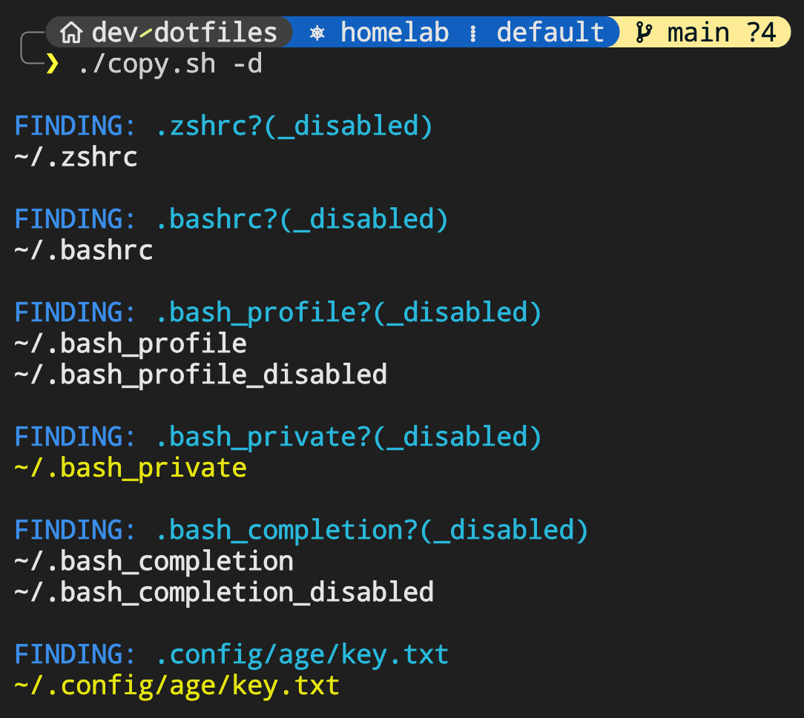
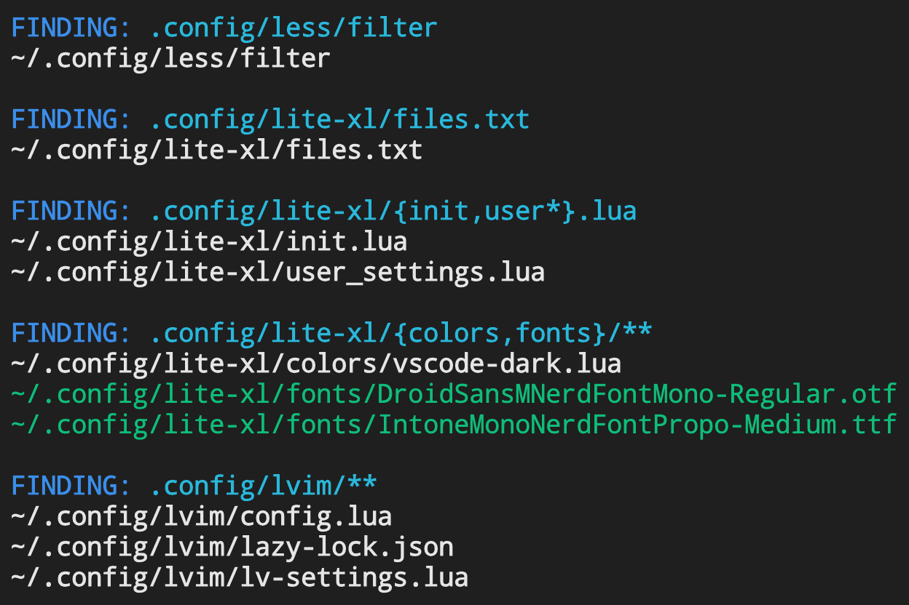
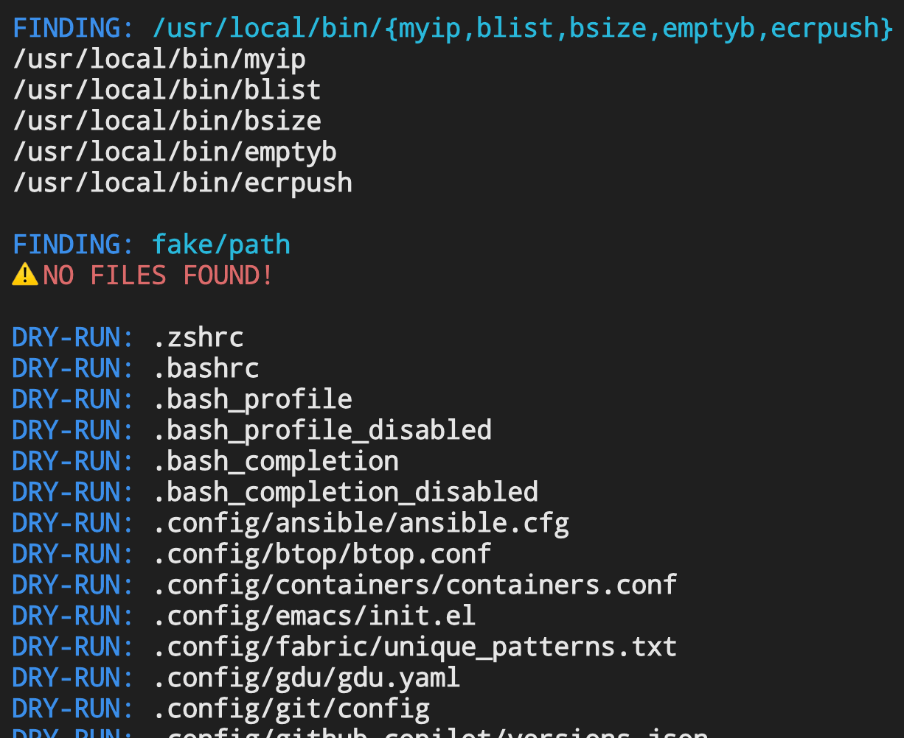
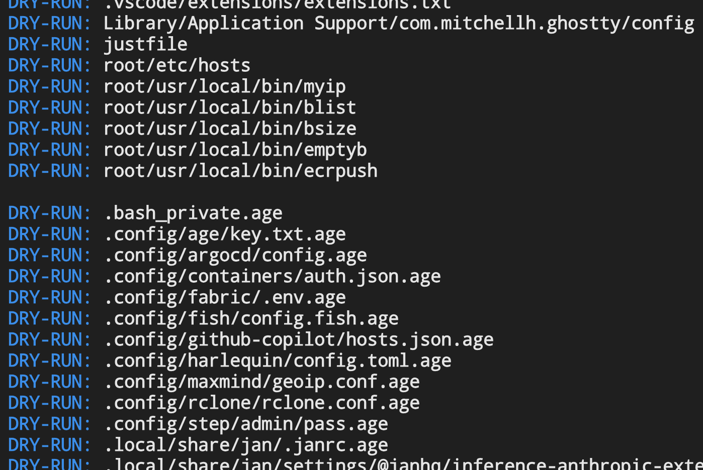
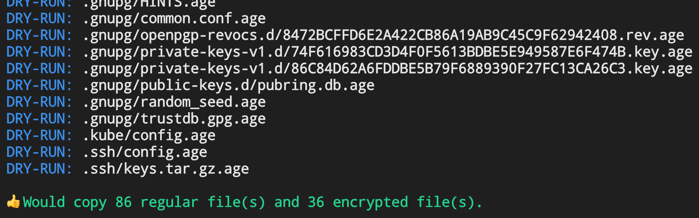

# Erhhung's Dot Files and Config Files

This project maintains a history of important dot files and other config
files on Erhhung's computers, but can be used by any Linux or macOS user
to track their config files, including files containing secrets, in Git.

## Organization

Git branches are used to isolate files from different machines and users.
This means that the `main` branch should only contain this "`README.md`"
file and the "`copy.sh`" script used to copy files explicitly listed in
the "`files.txt`" inventory file.

Branch names are typically a combination of host name and user name (e.g.
"`i9mbp-erhhung`") but since the host name can be long or change over time,
allowable names can be specified in the "`hosts.txt`" file, which the copy
script will verify before copying.

Since the "`copy.sh`" script must be invoked by the current user, if there
are files that are only readable by `root`, it's best to create a separate
branch (e.g. "`i9mbp-root`") in the "`/root`" (or "`/var/root`" on macOS)
directory on the machine and run the script as root.

All files and directories listed in "`files.txt`" are either relative paths
that are relative to the user's **home directory** or absolute paths (begin
with '`/`'). Paths relative to the user's home directory are stored directly
in this project's root directory while absolute paths are stored under the
"`root/`" subdirectory (e.g. "`root/etc/hosts`").

## Inventory

If on the `main` branch, see "[`files.txt`](./files.txt)" for examples of inventory paths.

### File Format

* **Whitespace and comments**

  * Leading and trailing whitespace are ignored
  * Comment lines begin with the '`#`' character
  * Trailing line comments are **not** supported

* **Relative and absolute paths**

  * Relative paths are relative to `$HOME` (so "`~/`" prefix is redundant)
  * Absolute paths begin with '`/`' (full path grafted under "`./root/`")
  * To copy all files and symlinks in a directory, path must end with '`/`'

* **Symbolic links**

  * Script copies regular files and symlinks only
  * Symlinks will not be followed (stored as-is)

* **Special characters**

  * Special characters `space`, '`$`' and '`&`' within a path are `\`-escaped
  * Characters like '`*`', '`?`', '`!`', parentheses, and braces, are used in standard and  
    extended glob patterns, so manually escape symbols that conflict with globbing

* **Glob patterns**

  * Paths support extended glob patterns via [`shopt -s extglob`](https://www.gnu.org/software/bash/manual/bash.html#The-Shopt-Builtin)
  * Paths support "`**`" glob patterns via [`shopt -s globstar`](https://www.gnu.org/software/bash/manual/bash.html#The-Shopt-Builtin)
  * Refer to the [Pattern Matching](https://www.gnu.org/software/bash/manual/bash.html#Pattern-Matching) section in the Bash documentation

* **File encryption**

  * Files matching paths that begin with '`|`' will be encrypted by the [`age`](https://github.com/FiloSottile/age) utility using  
    the identity (private key) referenced by the `AGE_KEY_FILE` environment variable
  * As best practice, each branch (different user/host combo) should have its own key
  * Encrypted files will have the `.age` file extension appended to their original names,  
    and be encoded to a PEM format (`-----BEGIN AGE ENCRYPTED FILE-----`)

## Usage

1. Clone this Git repository as the user whose dot files will be copied and stored.

2. Create or switch to the Git branch named "_\<hostname>_-_\<username>_"
   _(create the "`hosts.txt`" file containing alternate host names if desired)_.

3. Define paths in the inventory file "`files.txt`" to copy and store in this repo.

4. Run the copy script `copy.sh` _(first in "**dry-run**" mode highly recommended):_

    ```bash
    USAGE: ./copy.sh [-d|--dry-run]
    ```

5. Unless this Git repo will never be pushed to a public server, always run `git diff`
   (if a diff tool has been configured for Git) or another diff tool to verify what is
   about to be checked into Git contains no plain-text secrets.

6. Stage, commit, and push the changes in the Git branch.

### Example

<div align="center">
  <div style="display: inline-block; text-align: left;">
    
    <div style="line-height: 4px; font-size: 14px; position: relative; top: -7px; left: 6px;">···</div>
    
    <div style="line-height: 8px; font-size: 14px; position: relative; top: -5px; left: 6px;">···</div>
    
    <div style="line-height: 22px; font-size: 14px; position: relative; top: -5px; left: 6px;">···</div>
    
    <div style="line-height: 22px; font-size: 14px; position: relative; top: -5px; left: 6px;">···</div>
    
  </div>
</div>

### Colors

When output from `copy.sh` is not piped or redirected, the script uses colors
to distinguish between different types of files:

* **White** — regular file (not a symlink)
* **Yellow** — encrypted file (not a symlink)
* **Green** — symlink (generally not encrypted)
